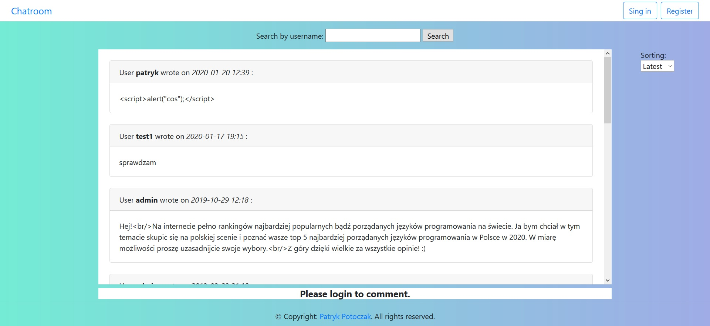
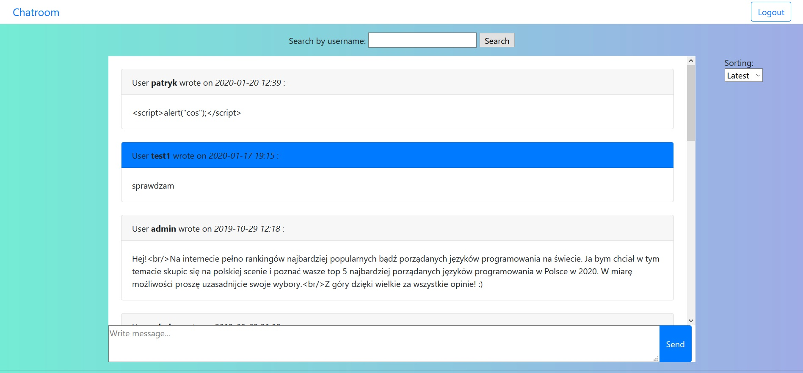

# Chatroom-JEE
> The application was created as a student project. This is a simple website that work as a simple web chat. Logged users can talk each other on various topics. They also can sort messages by date from the newest and oldest.

## Technologies
* Java 8
* Servlet
* JSP (JSTL)
* Hibernate 5
* MySQL
* Bootstrap 4

## Screenshots

---

